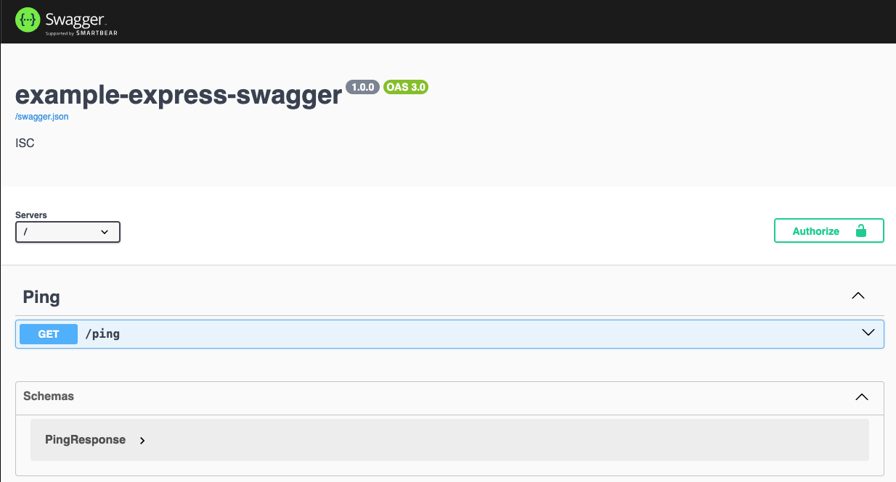

# REST API with Express and Swaggar

- https://rsbh.dev/blogs/rest-api-with-express-typescript

```shell
✗ npm init -y  

npm i -D typescript
# Express
npm i -S express
npm i -D @types/express @types/node
npm run build

# nodemon
npm i -D ts-node nodemon

# morgan: logging requests middleware
npm i -S morgan
npm i -D @types/morgan

# Swagger intergration
# tsoa: genenrate JSON file of OpenAPI specs
# swagger-ui-express: host Swagger UI
npm i -S tsoa swagger-ui-express
npm i -D @types/swagger-ui-express concurrently
```

```shell
✗ npm run dev
# Access http://localhost:8000/docs
```

