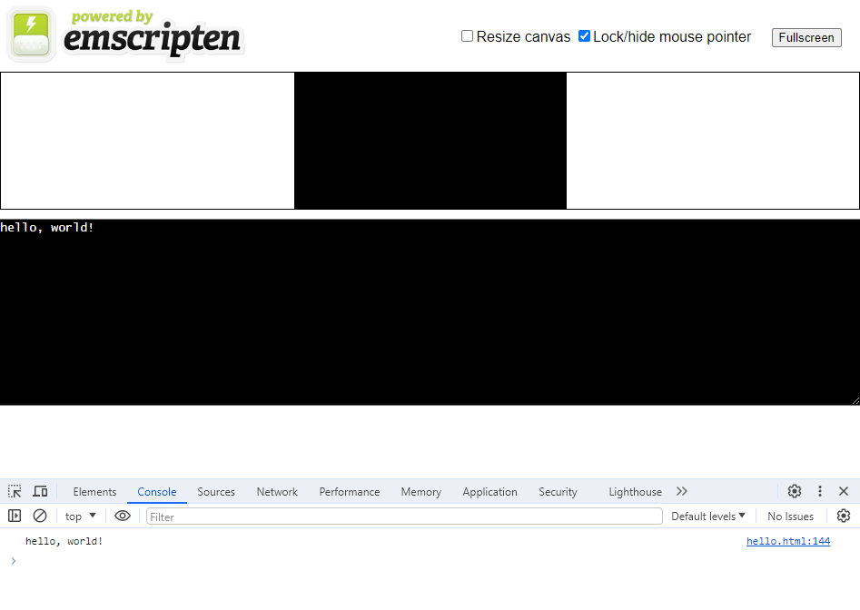
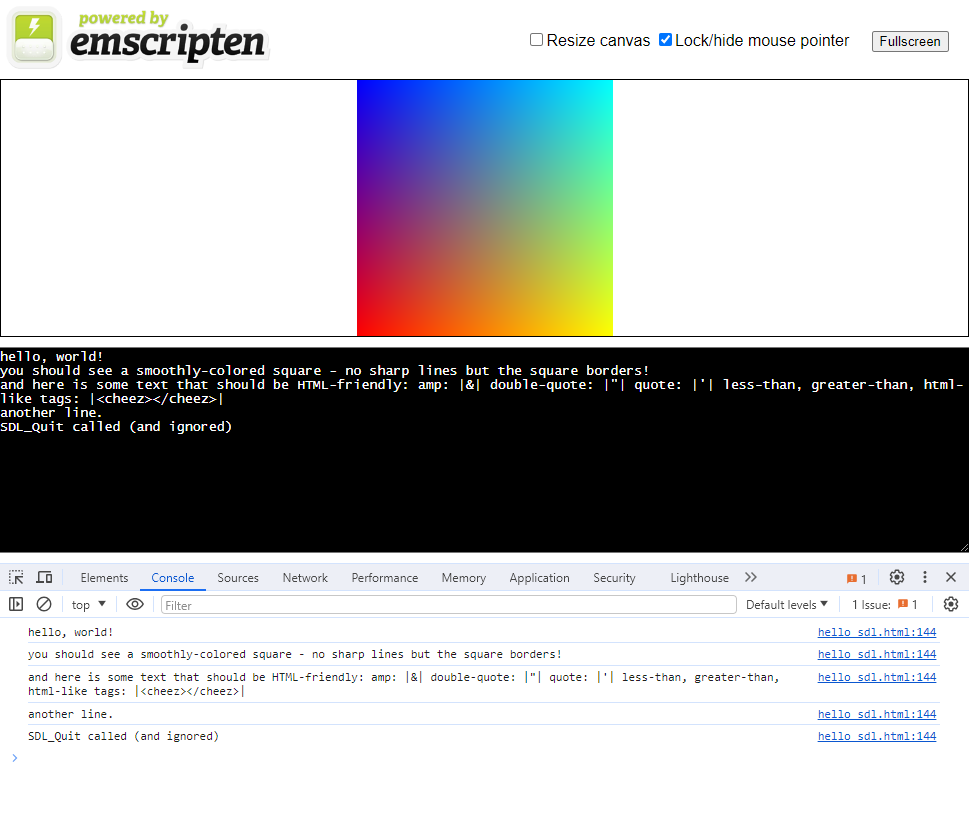
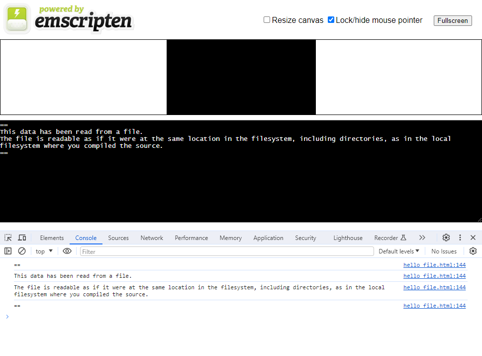
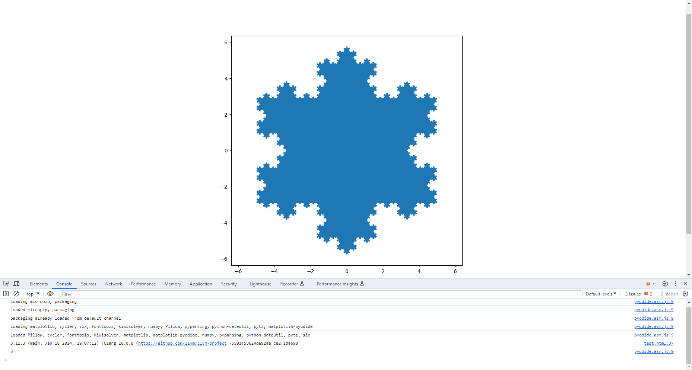

# WebAssembly

## Emscripten

- https://github.com/emscripten-core/emscripten

### emsdk

- Windows

```shell
git clone https://github.com/emscripten-core/emsdk
cd emsdk

D:\workspace\emsdk>emsdk.bat install latest

D:\workspace\emsdk>emsdk.bat activate latest
Resolving SDK alias 'latest' to '3.1.53'
Resolving SDK version '3.1.53' to 'sdk-releases-e5523d57a0e0dcf80f3b101bbc23613fcc3101aa-64bit'
Setting the following tools as active:
   node-16.20.0-64bit
   python-3.9.2-nuget-64bit
   java-8.152-64bit
   releases-e5523d57a0e0dcf80f3b101bbc23613fcc3101aa-64bit

Next steps:
- Consider running `emsdk activate` with --permanent or --system
  to have emsdk settings available on startup.
Adding directories to PATH:
PATH += D:\workspace\emsdk
PATH += D:\workspace\emsdk\node\16.20.0_64bit\bin
PATH += D:\workspace\emsdk\upstream\emscripten

Setting environment variables:
PATH = D:\workspace\emsdk;D:\workspace\emsdk\node\16.20.0_64bit\bin;D:\workspace\emsdk\upstream\emscripten;C:\Windows\system32;C:\Windows;C:\Windows\System32\Wbem;C:\Windows\System32\WindowsPowerShell\v1.0\;C:\Windows\System32\OpenSSH\;C:\Program Files\Docker\Docker\resources\bin;D:\Git\cmd;C:\Users\Administrator\go\bin;C:\Users\Administrator\scoop\apps\python\current\Scripts;C:\Users\Administrator\scoop\apps\python\current;C:\Users\Administrator\scoop\apps\maven\current\bin;C:\Users\Administrator\scoop\apps\openjdk17\current\bin;C:\Users\Administrator\scoop\apps\openjdk11\current\bin;C:\Users\Administrator\scoop\shims;C:\Users\Administrator\AppData\Local\Microsoft\WindowsApps;D:\Microsoft VS Code\bin
EMSDK = D:/workspace/emsdk
EMSDK_NODE = D:\workspace\emsdk\node\16.20.0_64bit\bin\node.exe
EMSDK_PYTHON = D:\workspace\emsdk\python\3.9.2-nuget_64bit\python.exe
JAVA_HOME = D:\workspace\emsdk\java\8.152_64bit
Clearing existing environment variable: EMSDK_PY
The changes made to environment variables only apply to the currently running shell instance. Use the 'emsdk_env.bat' to re-enter this environment later, or if you'd like to register this environment permanently, rerun this command with the option --permanent.
```

```shell
D:\workspace\emsdk>emcc -v
emcc (Emscripten gcc/clang-like replacement + linker emulating GNU ld) 3.1.53 (ce5114bdd2175c7297583d3c25a53ca95d22f4ce)
clang version 19.0.0git (https://github.com/llvm/llvm-project febb4c42b192ed7c88c17f91cb903a59acf20baf)
Target: wasm32-unknown-emscripten
Thread model: posix
InstalledDir: D:\workspace\emsdk\upstream\bin

$ emcc -print-search-dirs
programs: =D:/workspace/emsdk/upstream/bin
libraries: =D:\workspace\emsdk\upstream\emscripten\cache\sysroot\lib\wasm32-emscripten

├── clang++.exe
├── clang.exe
├── lld.exe
├── llvm-addr2line.exe
├── llvm-ar.exe
├── llvm-cxxfilt.exe
├── llvm-dwarfdump.exe
├── llvm-dwp.exe
├── llvm-nm.exe
├── llvm-objcopy.exe
├── llvm-objdump.exe
├── llvm-ranlib.exe
├── llvm-readobj.exe
├── llvm-size.exe
├── llvm-strings.exe
├── llvm-strip.exe
├── llvm-symbolizer.exe
├── wasm-as.exe
├── wasm-ctor-eval.exe
├── wasm-dis.exe
├── wasm-emscripten-finalize.exe
├── wasm-fuzz-lattices.exe
├── wasm-fuzz-types.exe
├── wasm-ld.exe
├── wasm-merge.exe
├── wasm-metadce.exe
├── wasm-opt.exe
├── wasm-reduce.exe
├── wasm-shell.exe
├── wasm-split.exe
├── wasm2js.exe
├── wasm32-clang++.exe
├── wasm32-clang.exe
├── wasm32-wasi-clang++.exe
└── wasm32-wasi-clang.exe

├── crt1.o
├── crt1_proxy_main.o
├── crt1_reactor.o
├── crtbegin.o
├── libGL-emu-full_es3-getprocaddr.a
├── libGL-emu-full_es3.a
├── libGL-emu-getprocaddr.a
├── libGL-emu-ofb-full_es3-getprocaddr.a
├── libGL-emu-ofb-full_es3.a
├── libGL-emu-ofb-getprocaddr.a
├── libGL-emu-ofb.a
├── libGL-emu-webgl2-full_es3-getprocaddr.a
├── libGL-emu-webgl2-full_es3.a
├── libGL-emu-webgl2-getprocaddr.a
├── libGL-emu-webgl2-ofb-full_es3-getprocaddr.a
├── libGL-emu-webgl2-ofb-full_es3.a
├── libGL-emu-webgl2-ofb-getprocaddr.a
├── libGL-emu-webgl2-ofb.a
├── libGL-emu-webgl2.a
├── libGL-emu.a
├── libGL-full_es3-getprocaddr.a
├── libGL-full_es3.a
├── libGL-getprocaddr.a
├── libGL-mt-emu-full_es3-getprocaddr.a
├── libGL-mt-emu-full_es3.a
├── libGL-mt-emu-getprocaddr.a
├── libGL-mt-emu-ofb-full_es3-getprocaddr.a
├── libGL-mt-emu-ofb-full_es3.a
├── libGL-mt-emu-ofb-getprocaddr.a
├── libGL-mt-emu-ofb.a
├── libGL-mt-emu-webgl2-full_es3-getprocaddr.a
├── libGL-mt-emu-webgl2-full_es3.a
├── libGL-mt-emu-webgl2-getprocaddr.a
├── libGL-mt-emu-webgl2-ofb-full_es3-getprocaddr.a
├── libGL-mt-emu-webgl2-ofb-full_es3.a
├── libGL-mt-emu-webgl2-ofb-getprocaddr.a
├── libGL-mt-emu-webgl2-ofb.a
├── libGL-mt-emu-webgl2.a
├── libGL-mt-emu.a
├── libGL-mt-full_es3-getprocaddr.a
├── libGL-mt-full_es3.a
├── libGL-mt-getprocaddr.a
├── libGL-mt-ofb-full_es3-getprocaddr.a
├── libGL-mt-ofb-full_es3.a
├── libGL-mt-ofb-getprocaddr.a
├── libGL-mt-ofb.a
├── libGL-mt-webgl2-full_es3-getprocaddr.a
├── libGL-mt-webgl2-full_es3.a
├── libGL-mt-webgl2-getprocaddr.a
├── libGL-mt-webgl2-ofb-full_es3-getprocaddr.a
├── libGL-mt-webgl2-ofb-full_es3.a
├── libGL-mt-webgl2-ofb-getprocaddr.a
├── libGL-mt-webgl2-ofb.a
├── libGL-mt-webgl2.a
├── libGL-mt.a
├── libGL-ofb-full_es3-getprocaddr.a
├── libGL-ofb-full_es3.a
├── libGL-ofb-getprocaddr.a
├── libGL-ofb.a
├── libGL-webgl2-full_es3-getprocaddr.a
├── libGL-webgl2-full_es3.a
├── libGL-webgl2-getprocaddr.a
├── libGL-webgl2-ofb-full_es3-getprocaddr.a
├── libGL-webgl2-ofb-full_es3.a
├── libGL-webgl2-ofb-getprocaddr.a
├── libGL-webgl2-ofb.a
├── libGL-webgl2.a
├── libGL-ww-emu-full_es3-getprocaddr.a
├── libGL-ww-emu-full_es3.a
├── libGL-ww-emu-getprocaddr.a
├── libGL-ww-emu-ofb-full_es3-getprocaddr.a
├── libGL-ww-emu-ofb-full_es3.a
├── libGL-ww-emu-ofb-getprocaddr.a
├── libGL-ww-emu-ofb.a
├── libGL-ww-emu-webgl2-full_es3-getprocaddr.a
├── libGL-ww-emu-webgl2-full_es3.a
├── libGL-ww-emu-webgl2-getprocaddr.a
├── libGL-ww-emu-webgl2-ofb-full_es3-getprocaddr.a
├── libGL-ww-emu-webgl2-ofb-full_es3.a
├── libGL-ww-emu-webgl2-ofb-getprocaddr.a
├── libGL-ww-emu-webgl2-ofb.a
├── libGL-ww-emu-webgl2.a
├── libGL-ww-emu.a
├── libGL-ww-full_es3-getprocaddr.a
├── libGL-ww-full_es3.a
├── libGL-ww-getprocaddr.a
├── libGL-ww-ofb-full_es3-getprocaddr.a
├── libGL-ww-ofb-full_es3.a
├── libGL-ww-ofb-getprocaddr.a
├── libGL-ww-ofb.a
├── libGL-ww-webgl2-full_es3-getprocaddr.a
├── libGL-ww-webgl2-full_es3.a
├── libGL-ww-webgl2-getprocaddr.a
├── libGL-ww-webgl2-ofb-full_es3-getprocaddr.a
├── libGL-ww-webgl2-ofb-full_es3.a
├── libGL-ww-webgl2-ofb-getprocaddr.a
├── libGL-ww-webgl2-ofb.a
├── libGL-ww-webgl2.a
├── libGL-ww.a
├── libGL.a
├── libSDL2.a
├── libal.a
├── libasan_js.a
├── libasan_rt-mt.a
├── libasan_rt-ww.a
├── libasan_rt.a
├── libbulkmemory-asan.a
├── libbulkmemory.a
├── libc++-except.a
├── libc++-mt-except.a
├── libc++-mt-noexcept.a
├── libc++-mt.a
├── libc++-noexcept.a
├── libc++-ww-except.a
├── libc++-ww-noexcept.a
├── libc++-ww.a
├── libc++.a
├── libc++abi-debug-except.a
├── libc++abi-debug-mt-except.a
├── libc++abi-debug-mt-noexcept.a
├── libc++abi-debug-mt.a
├── libc++abi-debug-noexcept.a
├── libc++abi-debug-ww-except.a
├── libc++abi-debug-ww-noexcept.a
├── libc++abi-debug-ww.a
├── libc++abi-debug.a
├── libc++abi-except.a
├── libc++abi-mt-except.a
├── libc++abi-mt-noexcept.a
├── libc++abi-mt.a
├── libc++abi-noexcept.a
├── libc++abi-ww-except.a
├── libc++abi-ww-noexcept.a
├── libc++abi-ww.a
├── libc++abi.a
├── libc-asan-debug.a
├── libc-asan.a
├── libc-debug.a
├── libc-mt-asan-debug.a
├── libc-mt-asan.a
├── libc-mt-debug.a
├── libc-mt.a
├── libc-ww-asan-debug.a
├── libc-ww-asan.a
├── libc-ww-debug.a
├── libc-ww.a
├── libc.a
├── libc_optz-asan-debug.a
├── libc_optz-asan.a
├── libc_optz-debug.a
├── libc_optz-mt-asan-debug.a
├── libc_optz-mt-asan.a
├── libc_optz-mt-debug.a
├── libc_optz-mt.a
├── libc_optz-ww-asan-debug.a
├── libc_optz-ww-asan.a
├── libc_optz-ww-debug.a
├── libc_optz-ww.a
├── libc_optz.a
├── libcompiler_rt-mt.a
├── libcompiler_rt-wasm-sjlj-mt.a
├── libcompiler_rt-wasm-sjlj-ww.a
├── libcompiler_rt-wasm-sjlj.a
├── libcompiler_rt-ww.a
├── libcompiler_rt.a
├── libdlmalloc-debug-tracing.a
├── libdlmalloc-debug.a
├── libdlmalloc-mt-debug-tracing.a
├── libdlmalloc-mt-debug.a
├── libdlmalloc-mt-tracing.a
├── libdlmalloc-mt.a
├── libdlmalloc-tracing.a
├── libdlmalloc-ww-debug-tracing.a
├── libdlmalloc-ww-debug.a
├── libdlmalloc-ww-tracing.a
├── libdlmalloc-ww.a
├── libdlmalloc.a
├── libembind-rtti.a
├── libembind.a
├── libemmalloc-debug-tracing.a
├── libemmalloc-debug.a
├── libemmalloc-memvalidate-mt-tracing.a
├── libemmalloc-memvalidate-mt.a
├── libemmalloc-memvalidate-tracing.a
├── libemmalloc-memvalidate-verbose-mt-tracing.a
├── libemmalloc-memvalidate-verbose-mt.a
├── libemmalloc-memvalidate-verbose-tracing.a
├── libemmalloc-memvalidate-verbose-ww-tracing.a
├── libemmalloc-memvalidate-verbose-ww.a
├── libemmalloc-memvalidate-verbose.a
├── libemmalloc-memvalidate-ww-tracing.a
├── libemmalloc-memvalidate-ww.a
├── libemmalloc-memvalidate.a
├── libemmalloc-mt-debug-tracing.a
├── libemmalloc-mt-debug.a
├── libemmalloc-mt-tracing.a
├── libemmalloc-mt.a
├── libemmalloc-tracing.a
├── libemmalloc-verbose-mt-tracing.a
├── libemmalloc-verbose-mt.a
├── libemmalloc-verbose-tracing.a
├── libemmalloc-verbose-ww-tracing.a
├── libemmalloc-verbose-ww.a
├── libemmalloc-verbose.a
├── libemmalloc-ww-debug-tracing.a
├── libemmalloc-ww-debug.a
├── libemmalloc-ww-tracing.a
├── libemmalloc-ww.a
├── libemmalloc.a
├── libfetch-mt.a
├── libfetch-ww.a
├── libfetch.a
├── libhtml5.a
├── libjsmath.a
├── liblsan_common_rt-mt.a
├── liblsan_common_rt-ww.a
├── liblsan_common_rt.a
├── liblsan_rt-mt.a
├── liblsan_rt-ww.a
├── liblsan_rt.a
├── libmimalloc-mt.a
├── libmimalloc-ww.a
├── libmimalloc.a
├── libnoexit.a
├── libprintf_long_double-asan-debug.a
├── libprintf_long_double-asan.a
├── libprintf_long_double-debug.a
├── libprintf_long_double-mt-asan-debug.a
├── libprintf_long_double-mt-asan.a
├── libprintf_long_double-mt-debug.a
├── libprintf_long_double-mt.a
├── libprintf_long_double-ww-asan-debug.a
├── libprintf_long_double-ww-asan.a
├── libprintf_long_double-ww-debug.a
├── libprintf_long_double-ww.a
├── libprintf_long_double.a
├── libsanitizer_common_rt-mt.a
├── libsanitizer_common_rt-ww.a
├── libsanitizer_common_rt.a
├── libsockets-mt.a
├── libsockets-ww.a
├── libsockets.a
├── libsockets_proxy-mt.a
├── libsockets_proxy-ww.a
├── libsockets_proxy.a
├── libstandalonewasm-memgrow-pure.a
├── libstandalonewasm-memgrow.a
├── libstandalonewasm-nocatch-memgrow-pure.a
├── libstandalonewasm-nocatch-memgrow.a
├── libstandalonewasm-nocatch-pure.a
├── libstandalonewasm-nocatch.a
├── libstandalonewasm-pure.a
├── libstandalonewasm.a
├── libstb_image.a
├── libstubs-debug.a
├── libstubs.a
├── libubsan_minimal_rt-mt.a
├── libubsan_minimal_rt-ww.a
├── libubsan_minimal_rt.a
├── libubsan_rt-mt.a
├── libubsan_rt-ww.a
├── libubsan_rt.a
├── libunwind-except.a
├── libunwind-mt-except.a
├── libunwind-mt-noexcept.a
├── libunwind-mt.a
├── libunwind-noexcept.a
├── libunwind-ww-except.a
├── libunwind-ww-noexcept.a
├── libunwind-ww.a
├── libunwind.a
├── libwasm_workers-debug.a
├── libwasm_workers.a
├── libwasm_workers_stub-debug.a
├── libwasm_workers_stub.a
├── libwasmfs-asan-debug-icase.a
├── libwasmfs-asan-debug.a
├── libwasmfs-asan-icase.a
├── libwasmfs-asan.a
├── libwasmfs-debug-icase.a
├── libwasmfs-debug.a
├── libwasmfs-icase.a
├── libwasmfs-mt-asan-debug-icase.a
├── libwasmfs-mt-asan-debug.a
├── libwasmfs-mt-asan-icase.a
├── libwasmfs-mt-asan.a
├── libwasmfs-mt-debug-icase.a
├── libwasmfs-mt-debug.a
├── libwasmfs-mt-icase.a
├── libwasmfs-mt.a
├── libwasmfs-ww-asan-debug-icase.a
├── libwasmfs-ww-asan-debug.a
├── libwasmfs-ww-asan-icase.a
├── libwasmfs-ww-asan.a
├── libwasmfs-ww-debug-icase.a
├── libwasmfs-ww-debug.a
├── libwasmfs-ww-icase.a
├── libwasmfs-ww.a
├── libwasmfs.a
├── libwasmfs_no_fs.a
├── libwasmfs_noderawfs.a
├── libwebgpu-mt.a
├── libwebgpu-ww.a
├── libwebgpu.a
├── libwebgpu_cpp-mt.a
├── libwebgpu_cpp-ww.a
└── libwebgpu_cpp.a
```


- MacOS

```shell
✗ ./emsdk install latest
Resolving SDK alias 'latest' to '3.1.56'
Resolving SDK version '3.1.56' to 'sdk-releases-9d106be887796484c4aaffc9dc45f48a8810f336-64bit'
Installing SDK 'sdk-releases-9d106be887796484c4aaffc9dc45f48a8810f336-64bit'..
Installing tool 'node-16.20.0-64bit'..
Downloading: /Users/zhang/workspace/github/learning-frontend-stack/webassembly/emscripten/emsdk-3.1.56/downloads/node-v16.20.0-darwin-x64.tar.gz from https://storage.googleapis.com/webassembly/emscripten-releases-builds/deps/node-v16.20.0-darwin-x64.tar.gz
################################################################################################################################################## 100.0%
Unpacking '/Users/zhang/workspace/github/learning-frontend-stack/webassembly/emscripten/emsdk-3.1.56/downloads/node-v16.20.0-darwin-x64.tar.gz' to '/Users/zhang/workspace/github/learning-frontend-stack/webassembly/emscripten/emsdk-3.1.56/node/16.20.0_64bit'
Done installing tool 'node-16.20.0-64bit'.
Installing tool 'python-3.9.2-64bit'..
Downloading: /Users/zhang/workspace/github/learning-frontend-stack/webassembly/emscripten/emsdk-3.1.56/downloads/python-3.9.2-3-macos-x86_64.tar.gz from https://storage.googleapis.com/webassembly/emscripten-releases-builds/deps/python-3.9.2-3-macos-x86_64.tar.gz
################################################################################################################################################## 100.0%
Unpacking '/Users/zhang/workspace/github/learning-frontend-stack/webassembly/emscripten/emsdk-3.1.56/downloads/python-3.9.2-3-macos-x86_64.tar.gz' to '/Users/zhang/workspace/github/learning-frontend-stack/webassembly/emscripten/emsdk-3.1.56/python/3.9.2_64bit'
Done installing tool 'python-3.9.2-64bit'.
Installing tool 'releases-9d106be887796484c4aaffc9dc45f48a8810f336-64bit'..
Downloading: /Users/zhang/workspace/github/learning-frontend-stack/webassembly/emscripten/emsdk-3.1.56/downloads/9d106be887796484c4aaffc9dc45f48a8810f336-wasm-binaries.tar.xz from https://storage.googleapis.com/webassembly/emscripten-releases-builds/mac/9d106be887796484c4aaffc9dc45f48a8810f336/wasm-binaries.tar.xz
################################################################################################################################################## 100.0%
Unpacking '/Users/zhang/workspace/github/learning-frontend-stack/webassembly/emscripten/emsdk-3.1.56/downloads/9d106be887796484c4aaffc9dc45f48a8810f336-wasm-binaries.tar.xz' to '/Users/zhang/workspace/github/learning-frontend-stack/webassembly/emscripten/emsdk-3.1.56/upstream'


Done installing tool 'releases-9d106be887796484c4aaffc9dc45f48a8810f336-64bit'.
Done installing SDK 'sdk-releases-9d106be887796484c4aaffc9dc45f48a8810f336-64bit'.

✗ ./emsdk activate latest
Resolving SDK alias 'latest' to '3.1.56'
Resolving SDK version '3.1.56' to 'sdk-releases-9d106be887796484c4aaffc9dc45f48a8810f336-64bit'
Setting the following tools as active:
   node-16.20.0-64bit
   python-3.9.2-64bit
   releases-9d106be887796484c4aaffc9dc45f48a8810f336-64bit

Next steps:
- To conveniently access emsdk tools from the command line,
  consider adding the following directories to your PATH:
    /Users/zhang/workspace/github/learning-frontend-stack/webassembly/emscripten/emsdk-3.1.56
    /Users/zhang/workspace/github/learning-frontend-stack/webassembly/emscripten/emsdk-3.1.56/upstream/emscripten
- This can be done for the current shell by running:
    source "/Users/zhang/workspace/github/learning-frontend-stack/webassembly/emscripten/emsdk-3.1.56/emsdk_env.sh"
- Configure emsdk in your shell startup scripts by running:
    echo 'source "/Users/zhang/workspace/github/learning-frontend-stack/webassembly/emscripten/emsdk-3.1.56/emsdk_env.sh"' >> $HOME/.zprofile
```

```shell
✗ emcc -v
emcc (Emscripten gcc/clang-like replacement + linker emulating GNU ld) 3.1.56 (cf90417346b78455089e64eb909d71d091ecc055)
clang version 19.0.0git (https:/github.com/llvm/llvm-project 34ba90745fa55777436a2429a51a3799c83c6d4c)
Target: wasm32-unknown-emscripten
Thread model: posix
InstalledDir: /Users/zhang/workspace/github/learning-frontend-stack/webassembly/emscripten/emsdk-3.1.56/upstream/bin

✗ emcc -print-search-dirs
programs: =/Users/zhang/workspace/github/learning-frontend-stack/webassembly/emscripten/emsdk-3.1.56/upstream/bin
libraries: =/Users/zhang/workspace/github/learning-frontend-stack/webassembly/emscripten/emsdk-3.1.56/upstream/emscripten/cache/sysroot/lib/wasm32-emscripten

✗ tree /Users/zhang/workspace/github/learning-frontend-stack/webassembly/emscripten/emsdk-3.1.56/upstream/bin
/Users/zhang/workspace/github/learning-frontend-stack/webassembly/emscripten/emsdk-3.1.56/upstream/bin
├── clang -> clang-19
├── clang++ -> clang
├── clang-19
├── lld
├── llvm-addr2line -> llvm-symbolizer
├── llvm-ar
├── llvm-cxxfilt
├── llvm-dwarfdump
├── llvm-dwp
├── llvm-nm
├── llvm-objcopy
├── llvm-objdump
├── llvm-ranlib -> llvm-ar
├── llvm-readobj
├── llvm-size
├── llvm-strings
├── llvm-strip -> llvm-objcopy
├── llvm-symbolizer
├── wasm-as
├── wasm-ctor-eval
├── wasm-dis
├── wasm-emscripten-finalize
├── wasm-fuzz-lattices
├── wasm-fuzz-types
├── wasm-ld -> lld
├── wasm-merge
├── wasm-metadce
├── wasm-opt
├── wasm-reduce
├── wasm-shell
├── wasm-split
├── wasm2js
├── wasm32-clang -> clang
├── wasm32-clang++ -> clang++
├── wasm32-wasi-clang -> clang
└── wasm32-wasi-clang++ -> clang++

✗ tree /Users/zhang/workspace/github/learning-frontend-stack/webassembly/emscripten/emsdk-3.1.56/upstream/emscripten/cache/sysroot/lib/wasm32-emscripten

/Users/zhang/workspace/github/learning-frontend-stack/webassembly/emscripten/emsdk-3.1.56/upstream/emscripten/cache/sysroot/lib/wasm32-emscripten
├── crt1.o
├── crt1_proxy_main.o
├── crt1_reactor.o
├── crtbegin.o
├── libGL-emu-full_es3-getprocaddr.a
├── libGL-emu-full_es3.a
├── libGL-emu-getprocaddr.a
├── libGL-emu-ofb-full_es3-getprocaddr.a
├── libGL-emu-ofb-full_es3.a
├── libGL-emu-ofb-getprocaddr.a
├── libGL-emu-ofb.a
├── libGL-emu-webgl2-full_es3-getprocaddr.a
├── libGL-emu-webgl2-full_es3.a
├── libGL-emu-webgl2-getprocaddr.a
├── libGL-emu-webgl2-ofb-full_es3-getprocaddr.a
├── libGL-emu-webgl2-ofb-full_es3.a
├── libGL-emu-webgl2-ofb-getprocaddr.a
├── libGL-emu-webgl2-ofb.a
├── libGL-emu-webgl2.a
├── libGL-emu.a
├── libGL-full_es3-getprocaddr.a
├── libGL-full_es3.a
├── libGL-getprocaddr.a
├── libGL-mt-emu-full_es3-getprocaddr.a
├── libGL-mt-emu-full_es3.a
├── libGL-mt-emu-getprocaddr.a
├── libGL-mt-emu-ofb-full_es3-getprocaddr.a
├── libGL-mt-emu-ofb-full_es3.a
├── libGL-mt-emu-ofb-getprocaddr.a
├── libGL-mt-emu-ofb.a
├── libGL-mt-emu-webgl2-full_es3-getprocaddr.a
├── libGL-mt-emu-webgl2-full_es3.a
├── libGL-mt-emu-webgl2-getprocaddr.a
├── libGL-mt-emu-webgl2-ofb-full_es3-getprocaddr.a
├── libGL-mt-emu-webgl2-ofb-full_es3.a
├── libGL-mt-emu-webgl2-ofb-getprocaddr.a
├── libGL-mt-emu-webgl2-ofb.a
├── libGL-mt-emu-webgl2.a
├── libGL-mt-emu.a
├── libGL-mt-full_es3-getprocaddr.a
├── libGL-mt-full_es3.a
├── libGL-mt-getprocaddr.a
├── libGL-mt-ofb-full_es3-getprocaddr.a
├── libGL-mt-ofb-full_es3.a
├── libGL-mt-ofb-getprocaddr.a
├── libGL-mt-ofb.a
├── libGL-mt-webgl2-full_es3-getprocaddr.a
├── libGL-mt-webgl2-full_es3.a
├── libGL-mt-webgl2-getprocaddr.a
├── libGL-mt-webgl2-ofb-full_es3-getprocaddr.a
├── libGL-mt-webgl2-ofb-full_es3.a
├── libGL-mt-webgl2-ofb-getprocaddr.a
├── libGL-mt-webgl2-ofb.a
├── libGL-mt-webgl2.a
├── libGL-mt.a
├── libGL-ofb-full_es3-getprocaddr.a
├── libGL-ofb-full_es3.a
├── libGL-ofb-getprocaddr.a
├── libGL-ofb.a
├── libGL-webgl2-full_es3-getprocaddr.a
├── libGL-webgl2-full_es3.a
├── libGL-webgl2-getprocaddr.a
├── libGL-webgl2-ofb-full_es3-getprocaddr.a
├── libGL-webgl2-ofb-full_es3.a
├── libGL-webgl2-ofb-getprocaddr.a
├── libGL-webgl2-ofb.a
├── libGL-webgl2.a
├── libGL-ww-emu-full_es3-getprocaddr.a
├── libGL-ww-emu-full_es3.a
├── libGL-ww-emu-getprocaddr.a
├── libGL-ww-emu-ofb-full_es3-getprocaddr.a
├── libGL-ww-emu-ofb-full_es3.a
├── libGL-ww-emu-ofb-getprocaddr.a
├── libGL-ww-emu-ofb.a
├── libGL-ww-emu-webgl2-full_es3-getprocaddr.a
├── libGL-ww-emu-webgl2-full_es3.a
├── libGL-ww-emu-webgl2-getprocaddr.a
├── libGL-ww-emu-webgl2-ofb-full_es3-getprocaddr.a
├── libGL-ww-emu-webgl2-ofb-full_es3.a
├── libGL-ww-emu-webgl2-ofb-getprocaddr.a
├── libGL-ww-emu-webgl2-ofb.a
├── libGL-ww-emu-webgl2.a
├── libGL-ww-emu.a
├── libGL-ww-full_es3-getprocaddr.a
├── libGL-ww-full_es3.a
├── libGL-ww-getprocaddr.a
├── libGL-ww-ofb-full_es3-getprocaddr.a
├── libGL-ww-ofb-full_es3.a
├── libGL-ww-ofb-getprocaddr.a
├── libGL-ww-ofb.a
├── libGL-ww-webgl2-full_es3-getprocaddr.a
├── libGL-ww-webgl2-full_es3.a
├── libGL-ww-webgl2-getprocaddr.a
├── libGL-ww-webgl2-ofb-full_es3-getprocaddr.a
├── libGL-ww-webgl2-ofb-full_es3.a
├── libGL-ww-webgl2-ofb-getprocaddr.a
├── libGL-ww-webgl2-ofb.a
├── libGL-ww-webgl2.a
├── libGL-ww.a
├── libGL.a
├── libal.a
├── libasan_js.a
├── libasan_rt-mt.a
├── libasan_rt-ww.a
├── libasan_rt.a
├── libbulkmemory-asan.a
├── libbulkmemory.a
├── libc++-except.a
├── libc++-mt-except.a
├── libc++-mt-noexcept.a
├── libc++-mt.a
├── libc++-noexcept.a
├── libc++-ww-except.a
├── libc++-ww-noexcept.a
├── libc++-ww.a
├── libc++.a
├── libc++abi-debug-except.a
├── libc++abi-debug-mt-except.a
├── libc++abi-debug-mt-noexcept.a
├── libc++abi-debug-mt.a
├── libc++abi-debug-noexcept.a
├── libc++abi-debug-ww-except.a
├── libc++abi-debug-ww-noexcept.a
├── libc++abi-debug-ww.a
├── libc++abi-debug.a
├── libc++abi-except.a
├── libc++abi-mt-except.a
├── libc++abi-mt-noexcept.a
├── libc++abi-mt.a
├── libc++abi-noexcept.a
├── libc++abi-ww-except.a
├── libc++abi-ww-noexcept.a
├── libc++abi-ww.a
├── libc++abi.a
├── libc-asan-debug.a
├── libc-asan.a
├── libc-debug.a
├── libc-mt-asan-debug.a
├── libc-mt-asan.a
├── libc-mt-debug.a
├── libc-mt.a
├── libc-ww-asan-debug.a
├── libc-ww-asan.a
├── libc-ww-debug.a
├── libc-ww.a
├── libc.a
├── libc_optz-asan-debug.a
├── libc_optz-asan.a
├── libc_optz-debug.a
├── libc_optz-mt-asan-debug.a
├── libc_optz-mt-asan.a
├── libc_optz-mt-debug.a
├── libc_optz-mt.a
├── libc_optz-ww-asan-debug.a
├── libc_optz-ww-asan.a
├── libc_optz-ww-debug.a
├── libc_optz-ww.a
├── libc_optz.a
├── libcompiler_rt-mt.a
├── libcompiler_rt-wasm-sjlj-mt.a
├── libcompiler_rt-wasm-sjlj-ww.a
├── libcompiler_rt-wasm-sjlj.a
├── libcompiler_rt-ww.a
├── libcompiler_rt.a
├── libdlmalloc-debug-tracing.a
├── libdlmalloc-debug.a
├── libdlmalloc-mt-debug-tracing.a
├── libdlmalloc-mt-debug.a
├── libdlmalloc-mt-tracing.a
├── libdlmalloc-mt.a
├── libdlmalloc-tracing.a
├── libdlmalloc-ww-debug-tracing.a
├── libdlmalloc-ww-debug.a
├── libdlmalloc-ww-tracing.a
├── libdlmalloc-ww.a
├── libdlmalloc.a
├── libembind-rtti.a
├── libembind.a
├── libemmalloc-debug-tracing.a
├── libemmalloc-debug.a
├── libemmalloc-memvalidate-mt-tracing.a
├── libemmalloc-memvalidate-mt.a
├── libemmalloc-memvalidate-tracing.a
├── libemmalloc-memvalidate-verbose-mt-tracing.a
├── libemmalloc-memvalidate-verbose-mt.a
├── libemmalloc-memvalidate-verbose-tracing.a
├── libemmalloc-memvalidate-verbose-ww-tracing.a
├── libemmalloc-memvalidate-verbose-ww.a
├── libemmalloc-memvalidate-verbose.a
├── libemmalloc-memvalidate-ww-tracing.a
├── libemmalloc-memvalidate-ww.a
├── libemmalloc-memvalidate.a
├── libemmalloc-mt-debug-tracing.a
├── libemmalloc-mt-debug.a
├── libemmalloc-mt-tracing.a
├── libemmalloc-mt.a
├── libemmalloc-tracing.a
├── libemmalloc-verbose-mt-tracing.a
├── libemmalloc-verbose-mt.a
├── libemmalloc-verbose-tracing.a
├── libemmalloc-verbose-ww-tracing.a
├── libemmalloc-verbose-ww.a
├── libemmalloc-verbose.a
├── libemmalloc-ww-debug-tracing.a
├── libemmalloc-ww-debug.a
├── libemmalloc-ww-tracing.a
├── libemmalloc-ww.a
├── libemmalloc.a
├── libfetch-mt.a
├── libfetch-ww.a
├── libfetch.a
├── libhtml5.a
├── libjsmath.a
├── liblsan_common_rt-mt.a
├── liblsan_common_rt-ww.a
├── liblsan_common_rt.a
├── liblsan_rt-mt.a
├── liblsan_rt-ww.a
├── liblsan_rt.a
├── libmimalloc-mt.a
├── libmimalloc-ww.a
├── libmimalloc.a
├── libnoexit.a
├── libprintf_long_double-asan-debug.a
├── libprintf_long_double-asan.a
├── libprintf_long_double-debug.a
├── libprintf_long_double-mt-asan-debug.a
├── libprintf_long_double-mt-asan.a
├── libprintf_long_double-mt-debug.a
├── libprintf_long_double-mt.a
├── libprintf_long_double-ww-asan-debug.a
├── libprintf_long_double-ww-asan.a
├── libprintf_long_double-ww-debug.a
├── libprintf_long_double-ww.a
├── libprintf_long_double.a
├── libsanitizer_common_rt-mt.a
├── libsanitizer_common_rt-ww.a
├── libsanitizer_common_rt.a
├── libsockets-mt.a
├── libsockets-ww.a
├── libsockets.a
├── libsockets_proxy-mt.a
├── libsockets_proxy-ww.a
├── libsockets_proxy.a
├── libstandalonewasm-memgrow-pure.a
├── libstandalonewasm-memgrow.a
├── libstandalonewasm-nocatch-memgrow-pure.a
├── libstandalonewasm-nocatch-memgrow.a
├── libstandalonewasm-nocatch-pure.a
├── libstandalonewasm-nocatch.a
├── libstandalonewasm-pure.a
├── libstandalonewasm.a
├── libstb_image.a
├── libstubs-debug.a
├── libstubs.a
├── libubsan_minimal_rt-mt.a
├── libubsan_minimal_rt-ww.a
├── libubsan_minimal_rt.a
├── libubsan_rt-mt.a
├── libubsan_rt-ww.a
├── libubsan_rt.a
├── libunwind-except.a
├── libunwind-mt-except.a
├── libunwind-mt-noexcept.a
├── libunwind-mt.a
├── libunwind-noexcept.a
├── libunwind-ww-except.a
├── libunwind-ww-noexcept.a
├── libunwind-ww.a
├── libunwind.a
├── libwasm_workers-debug.a
├── libwasm_workers.a
├── libwasm_workers_stub-debug.a
├── libwasm_workers_stub.a
├── libwasmfs-asan-debug-icase.a
├── libwasmfs-asan-debug.a
├── libwasmfs-asan-icase.a
├── libwasmfs-asan.a
├── libwasmfs-debug-icase.a
├── libwasmfs-debug.a
├── libwasmfs-icase.a
├── libwasmfs-mt-asan-debug-icase.a
├── libwasmfs-mt-asan-debug.a
├── libwasmfs-mt-asan-icase.a
├── libwasmfs-mt-asan.a
├── libwasmfs-mt-debug-icase.a
├── libwasmfs-mt-debug.a
├── libwasmfs-mt-icase.a
├── libwasmfs-mt.a
├── libwasmfs-ww-asan-debug-icase.a
├── libwasmfs-ww-asan-debug.a
├── libwasmfs-ww-asan-icase.a
├── libwasmfs-ww-asan.a
├── libwasmfs-ww-debug-icase.a
├── libwasmfs-ww-debug.a
├── libwasmfs-ww-icase.a
├── libwasmfs-ww.a
├── libwasmfs.a
├── libwasmfs_no_fs.a
├── libwasmfs_noderawfs.a
├── libwebgpu-mt.a
├── libwebgpu-ww.a
├── libwebgpu.a
├── libwebgpu_cpp-mt.a
├── libwebgpu_cpp-ww.a
└── libwebgpu_cpp.a
```

### Totorial

- [hello_world.c](./emscripten/tutorial/hello_world.c)

```shell
$ emcc hello_world.c -o hello_world.html
$ python3 -m http.server
# Access http://localhost:8000/hello_world.html
```



- [hello_world_sdl.cpp](./emscripten/tutorial/hello_world_sdl.cpp)

```shell
$ emcc hello_world_sdl.cpp -o hello_sdl.html

# Point SDL2 port at upstream: https://github.com/emscripten-core/emscripten/pull/15452
```



- [hello_world_file.cpp](./emscripten/tutorial/hello_world_file.cpp)

```shell
$ emcc hello_world_file.cpp -o hello_file.html --preload-file hello_world_file.txt
```



## pyodide

- https://github.com/pyodide/pyodide

- [test.html](./pyodide/test.html)

```shell
$ python3 -m http.server
# Access http://localhost:8000/test.html
```


